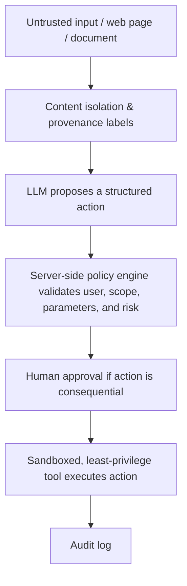

# Release Notes: SAT Exam Prep Platform (v1.0.0)

Welcome to the latest release of the SAT Exam Prep platform! This document summarizes all student-facing features, the architectural decisions that make them robust, and the aggressive security measures we've implemented to ensure student data and platform integrity remain uncompromised.

---

## 🎓 Student-Centric Features

### 1. Frictionless, Passwordless Login
**Feature:** Students access the platform using a 5-Digit OTP (One-Time Password) sent directly to their email. 
**Why it's great:** Eliminates the burden of remembering complex passwords and completely nullifies the risk of password reuse or credential stuffing attacks.

### 2. Comprehensive Practice & Review 
**Feature:** Full-length test practice modules paired with an interactive Review Mode.
**Why it's great:** Students can simulate real exam conditions and immediately review detailed answer explanations to understand their mistakes.

### 3. Asynchronous "Ask AI Tutor"
**Feature:** Students can request personalized, AI-driven explanations for any question they struggle with. 
**Why it's great:** Instead of generic answers, the AI Tutor uses AWS Bedrock to generate tailored advice asynchronously without locking up the user interface.

### 4. Mistake Journal & Daily Challenges
**Feature:** A dedicated journal to track historically incorrect answers and a daily micro-challenge system to maintain engagement.
**Why it's great:** Prevents fatigue by mixing intense study sessions with short, gamified 5-minute daily check-ins to build consistent study habits.

### 5. Exam Popularity & Rating System
**Feature:** Students can rate tests and review community difficulty ratings.
**Why it's great:** Allows students to organically discover the most helpful or appropriately challenging practice materials based on peer feedback.

### 6. Interactive Dashboard & Score Tracking
**Feature:** Visual charts mapping score progression and a Daily Summary email.
**Why it's great:** Provides transparent, data-driven insights into a student's strengths and weaknesses, aligning with school tutoring goals for Algebra 2 and Advanced Math.

---

## 🔒 Security, Safety, & Compliance

We treat student safety and platform security with absolute zero-trust brutality. Here is how we guarantee a safe environment:

### Data Isolation & Least Privilege
Every feature on this platform is powered by highly restricted, purpose-built microservices. For example, the Lambda function that calculates your score has strictly **read-only** access to the database. The function that receives your test submission cannot read other students' data. If one microservice were theoretically compromised, the blast radius is strictly contained.

### AI Sandbox (Prompt Injection Defense)
The "Ask AI Tutor" feature utilizes Large Language Models (LLMs). We assume all LLM inputs are untrusted. To protect against "indirect prompt injections" (where malicious text attempts to hijack the AI), the AI Tutor operates in a completely isolated AWS sandbox using a strict **Secure Agent Pattern**:

By following this pattern, the AI Tutor has zero access to production databases, administrative credentials, or deployment pipelines. It can only read the specific, isolated question context, propose a response, and return the advice. Any consequential actions (which the tutor cannot perform) would be hard-stopped by the policy engine.

### CI/CD Deployment Firewall
No human developer or AI coding agent has direct deployment access to the production environment. All updates are forced through a protected GitHub Actions CI/CD pipeline using ephemeral OIDC authentication. This eliminates the risk of stolen developer laptops or compromised agent workspaces affecting production.

### Cost-Protection & DDoS Mitigation
The architecture leverages AWS Serverless (API Gateway, Lambda, DynamoDB, SQS) protected by strict concurrency limits, CloudWatch alarms, and AWS Budgets. Even under a massive surge of 100,000+ students (or a malicious traffic flood), the system will scale securely without causing unexpected billing catastrophes.

### COPPA & Legal Compliance
The platform includes built-in age gates, explicit Terms of Use, and Privacy Policies to ensure data collection complies with standards for high school students (13+).

---

## ⚖️ Recommended Disclaimer (For Login Page)

To ensure transparency, we recommend adding the following concise disclaimer to the footer of the `LoginScreen.jsx` or main landing page:

> **Student Safety & AI Disclaimer**
> *This platform uses secure, passwordless authentication to protect your account. For your privacy, do not submit personally identifiable information (PII) into the "Ask AI Tutor" feature. AI-generated advice is designed to guide your learning but should not replace official College Board materials. By logging in, you agree to our [Terms of Use](#) and [Privacy Policy](#), and confirm you meet the minimum age requirements.*
