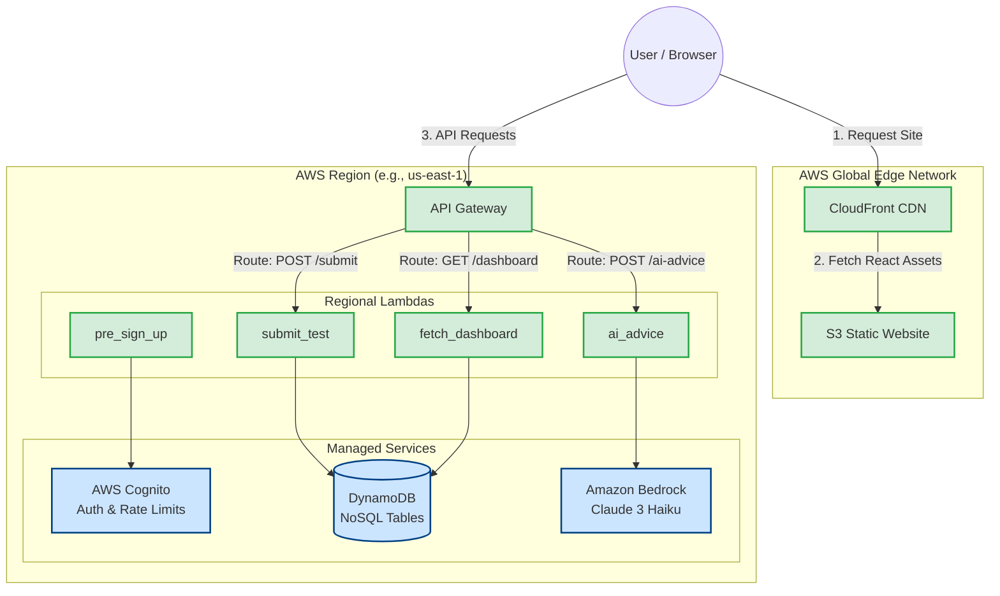
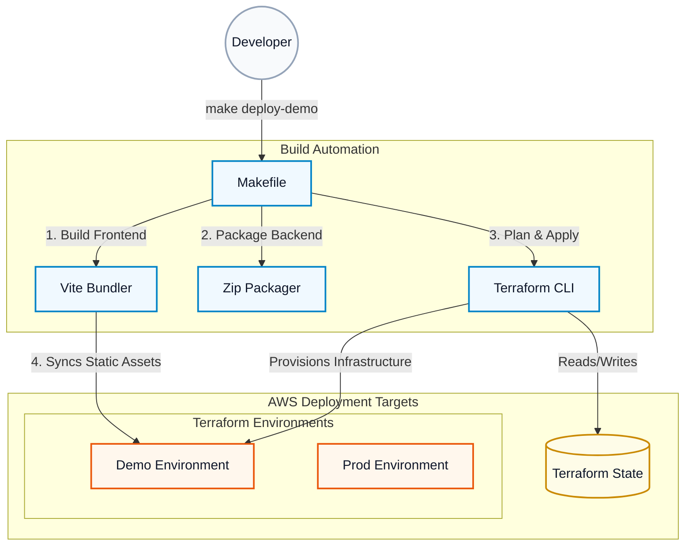

# SAT Prep Application Architecture

This document outlines the highly-optimized, 100% serverless architecture of the SAT Prep Application.

## Architecture Diagram

## Architectural Design Principles

> [!TIP]
> **Performance & Cost Efficiency**
> By strictly splitting static delivery and backend compute, we achieve the lowest possible latency and cost. 

1. **CloudFront + S3 (Static Hosting):** React files are cached globally at Edge locations. The user's browser downloads the UI instantly, completely bypassing compute costs.
2. **API Gateway + Regional Lambdas (Compute):** API requests go directly to our regional backend. Regional Lambdas execute fast, share a single cold-start pool per region, and operate comfortably within the 1 million free requests/month tier.
3. **Managed Services (Data & Auth):** DynamoDB and Cognito handle state securely at scale without any infrastructure maintenance.
4. **AI Integration:** Amazon Bedrock (Claude 3 Haiku) provides cost-effective, high-speed Socratic tutoring directly via Serverless Lambda integration.

## Deployment Architecture

This section outlines how infrastructure and application code are automatically compiled, packaged, and deployed via Terraform and Make, ensuring a strict Infrastructure as Code (IaC) methodology.

### Deployment Strategy

> [!NOTE]
> **Environment Separation**
> The deployment pipeline utilizes isolated environments (like `demo` and `prod`) allowing safe testing of infrastructure changes before they impact real users.

1. **Makefile Orchestration:** A centralized `Makefile` orchestrates the entire build and deployment lifecycle (e.g., `make deploy-demo`).
2. **Asset Compilation & Packaging:** 
   * The frontend React application is aggressively bundled and minified using Vite for lightning-fast delivery.
   * Backend Node.js Lambdas are zipped into isolated deployment artifacts, ensuring small footprint and fast cold starts.
3. **Infrastructure as Code (IaC):** Terraform evaluates the `serverless.tf` configurations, compares them against the remote state, and automatically provisions or updates the API Gateway, Cognito User Pools, DynamoDB Tables, SQS Queues, and CloudWatch Alarms.
4. **Static Sync:** Finally, the compiled frontend assets are synchronized directly to the newly provisioned S3 bucket, updating the CloudFront Edge CDN.
