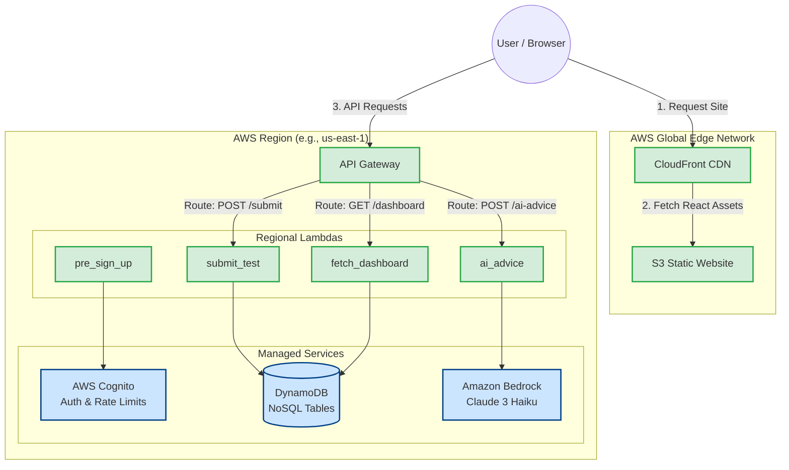

# SAT Prep Application Architecture

This document outlines the highly-optimized, 100% serverless architecture of the SAT Prep Application.

## Architecture Diagram

## Architectural Design Principles

> [!TIP]
> **Performance & Cost Efficiency**
> By strictly splitting static delivery and backend compute, we achieve the lowest possible latency and cost. 

1. **CloudFront + S3 (Static Hosting):** React files are cached globally at Edge locations. The user's browser downloads the UI instantly, completely bypassing compute costs.
2. **API Gateway + Regional Lambdas (Compute):** API requests go directly to our regional backend. Regional Lambdas execute fast, share a single cold-start pool per region, and operate comfortably within the 1 million free requests/month tier.
3. **Managed Services (Data & Auth):** DynamoDB and Cognito handle state securely at scale without any infrastructure maintenance.
4. **AI Integration:** Amazon Bedrock (Claude 3 Haiku) provides cost-effective, high-speed Socratic tutoring directly via Serverless Lambda integration.
