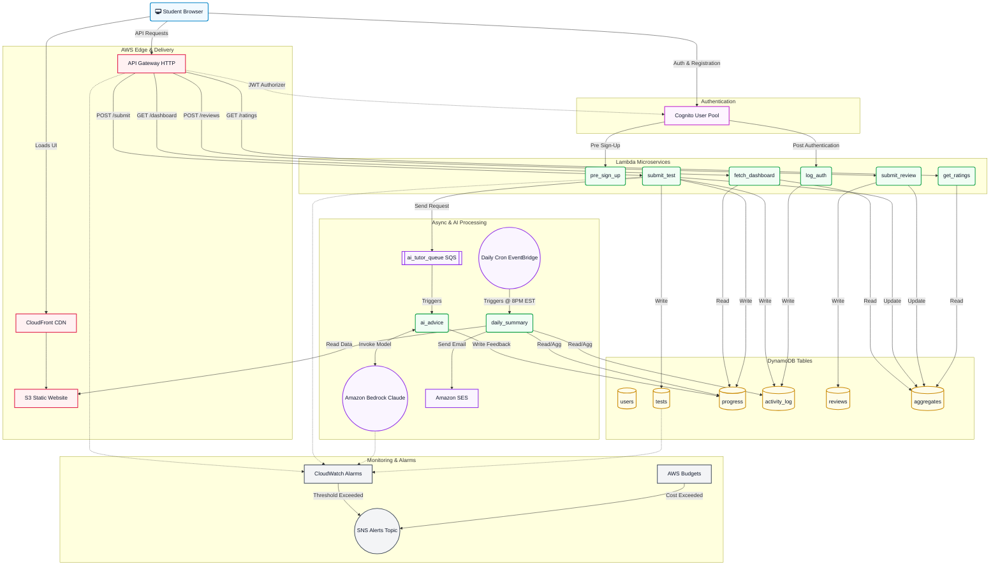

# SAT Prep Platform Architecture

This diagram illustrates the complete AWS serverless architecture, derived directly from your Terraform inventory and configuration files (`main.tf` and `serverless.tf`).

