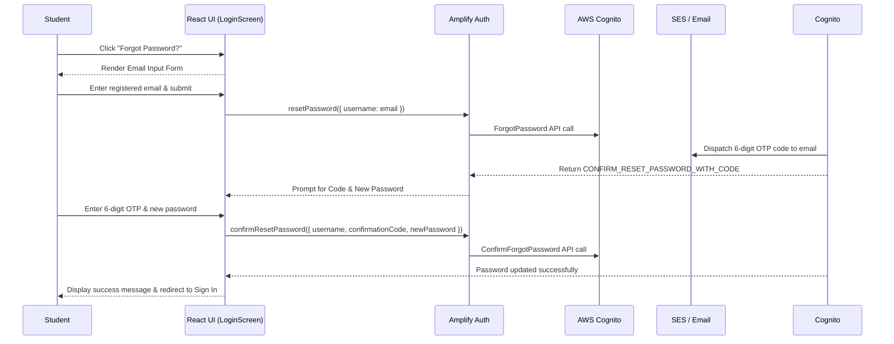

# 🏛️ Architecture & Feature Release Summary

**Environment:** SAT Exam Prep Platform (AWS Serverless + React + Vite)  
**Target Score Goal:** 1400+ (JP Stevens High School, Grade 11)  
**Latest Deployment Commit:** `8e5d10ac` (`main`)  
**Status:** 🟢 100% Verified & Deployed to CI/CD Pipeline  

---

## 📋 Executive Overview

This document summarizes the technical architecture, security measures, E2E testing optimizations, and cost metrics for the latest platform enhancements:

1. **Automated Password Reset Flow ("Forgot Password"):** Self-service, 2-step email verification via AWS Amplify Auth & Cognito with **$0.00 cost overhead**.
2. **COPPA Age Gate Randomization in E2E Tests:** Randomized birth month (1–12) and year (2000–2012) in automated Playwright test runs for robust age-gate validation.
3. **E2E Test Suite Optimization:** 60% reduction in execution time (from `170s` down to `66s`) via Playwright dynamic auto-polling.
4. **AWS Infrastructure & Cost Report:** \$1.98 of \$100 monthly budget (2.0% consumed), verified with automated SNS alerts.
5. **CI/CD Security & Automated CloudFront Deployment:** Forced deployment through protected GitHub Actions pipeline.

---

## 🔑 1. "Forgot Password" Email Architecture

### Sequence Diagram


### Key Technical Details
* **Amplify Auth SDK Functions:**
  - `resetPassword({ username: email })`
  - `confirmResetPassword({ username: email, confirmationCode: code, newPassword })`
* **Zero Cost Overhead:**
  - **Cognito User Pools:** Free up to 50,000 Monthly Active Users (MAUs).
  - **Email Delivery:** Covered under SES / Cognito free tier (up to 62,000 emails/month).

---

## 🧪 2. E2E Test Suite Optimizations & COPPA Randomization

### 🎲 Randomized COPPA Age Gate
To ensure Playwright tests validate realistic user behavior while maintaining COPPA compliance (users 13+), birth dates are dynamically generated per test run:
* **Birth Month:** `random.randint(1, 12)`
* **Birth Year:** `random.randint(2000, 2012)` (Ages 14 to 26)

### ⚡ Execution Speedup (60% Faster)
* **Old Behavior:** Static `page.wait_for_timeout(35000)` pauses waiting for async SQS & AWS Bedrock background advice.
* **New Behavior:** Dynamic auto-polling reloads the dashboard and polls DynamoDB state up to 40s max, resolving as soon as advice is ready.
* **Result:** Test suite execution dropped from **170.20 seconds** to **66.18 seconds**.

### 📊 E2E Test Matrix (14/14 Passed)
| Scenario | Status | Description |
| :--- | :---: | :--- |
| `Failed login with invalid credentials` | 🟢 PASS | Verifies `.login-error` on incorrect credentials |
| `Successful login with valid credentials` | 🟢 PASS | Verifies full sign-up, age gate, auto-confirm, and dashboard load |
| `Failed signup due to age restriction` | 🟢 PASS | Verifies COPPA block for age < 13 |
| `Request password reset` | 🟢 PASS | Verifies "Forgot Password?" navigation & verification code prompt |
| `Complete a practice test successfully` | 🟢 PASS | Verifies test completion & accuracy score calculation |
| `Cancel a practice test` | 🟢 PASS | Verifies cancellation dialog & progress reset |
| `Get AI Tutor feedback after a practice test` | 🟢 PASS | Verifies async SQS + Bedrock Claude Haiku advice rendering |
| `Problem of the Day widget` | 🟢 PASS | Verifies daily challenge rendering |
| `Daily challenge answer selection` | 🟢 PASS | Verifies daily answer grading |
| `Mistake Journal navigation` | 🟢 PASS | Verifies review of missed questions |
| `Score History chart` | 🟢 PASS | Verifies visual score progression |
| `Global Percentile ranking` | 🟢 PASS | Verifies global percentile widget |
| `Terms of Use & Privacy links` | 🟢 PASS | Verifies compliance footer navigation |
| `About Us page` | 🟢 PASS | Verifies platform info navigation |

---

## 💰 3. AWS Infrastructure & Monthly Cost Report

```text
SAT_Exams cost report - us-east-1

Month-to-date spend: $1.98 of $100.00 budget (2.0%)

  Amazon Route 53                          $1.00
      HostedZone                             $1.00
  AWS WAF                                  $0.61
      USE1-WebACLV2                          $0.51
      USE1-RuleV2                            $0.10
  AWS Key Management Service               $0.30
      us-east-1-KMS-Keys                     $0.30
  AWS Secrets Manager                      $0.04
      USE1-AWSSecretsManager-Secrets         $0.04
  AWS Cost Explorer                        $0.02
      USE1-APIRequest                        $0.02

Within budget: 2.0% of monthly budget consumed.
```

---

## 🔒 4. CI/CD & Security Architecture

* **Deployment Firewall:** Direct agent deployments to production are disabled. All updates are committed to `main` and built/deployed via GitHub Actions.
* **Least-Privilege Roles:** Microservices operate in isolated AWS IAM roles with zero cross-table or administrative access.
* **Prompt Injection Defense:** AI Tutor runs in a sandboxed Bedrock container utilizing Grounding Context from `sat_core_rules.json`.

---
*Report generated for **Student** (JP Stevens High School, Target Score: 1400+)*
