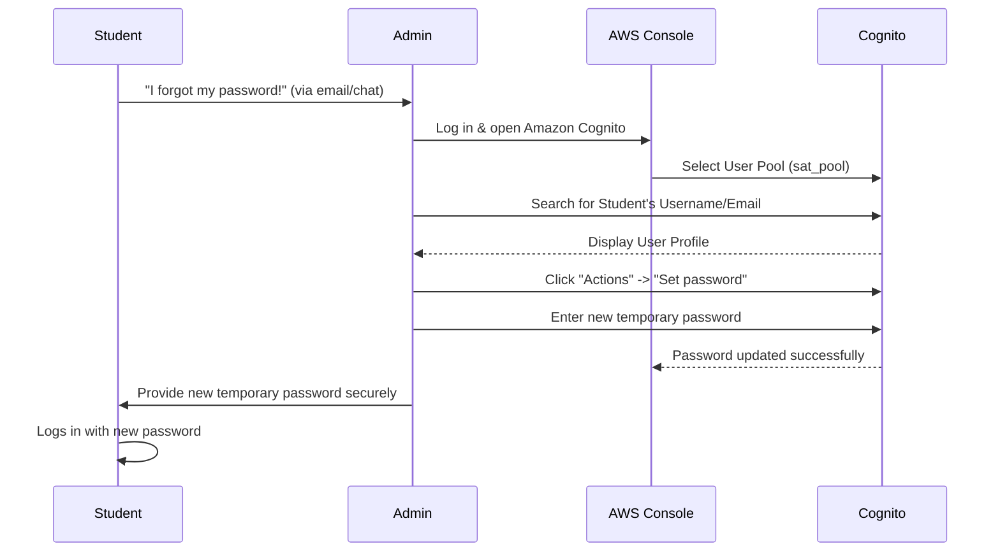

# Manual Password Reset Guide (AWS Console)

Since we are prioritizing COPPA compliance and kid safety, we do not have an automated "Forgot Password" flow via email. If a student forgets their password, an administrator must manually reset it using the AWS Cognito Console.

## Workflow Overview

## Step-by-Step Instructions for Administrators

Follow these exact steps in the AWS Console to reset a student's password:

1. **Log in to AWS:** 
   Go to the [AWS Management Console](https://console.aws.amazon.com/) and log in with your administrator credentials.

2. **Navigate to Cognito:** 
   Search for **Cognito** in the top search bar and open the service.

3. **Select the User Pool:**
   Click on **User pools** in the left-hand navigation pane, then click on the User Pool for this environment (e.g., `sat_pool` or `sat_pool_demo`).

4. **Find the Student:**
   - Under the **Users** tab, use the search bar to look up the student by their `Username` or `Email`.
   - Click on the student's **Username** to open their profile.

5. **Set the New Password:**
   - In the top right corner of the user's profile page, click the **Actions** dropdown menu.
   - Select **Set password**.
   - A modal will appear. Choose whether to set a **Permanent** password (they keep it) or a **Temporary** password (they must change it upon their next login).
   - *Recommendation:* Set a simple **Permanent** password (e.g., `SatPrep2026!`) since we do not have a forced password-change UI built into our custom frontend yet.
   - Type the new password and click **Set password**.

6. **Notify the Student:**
   Securely communicate the new password to the student or their parent. They will immediately be able to log in using the new credentials on the SAT Dashboard.
