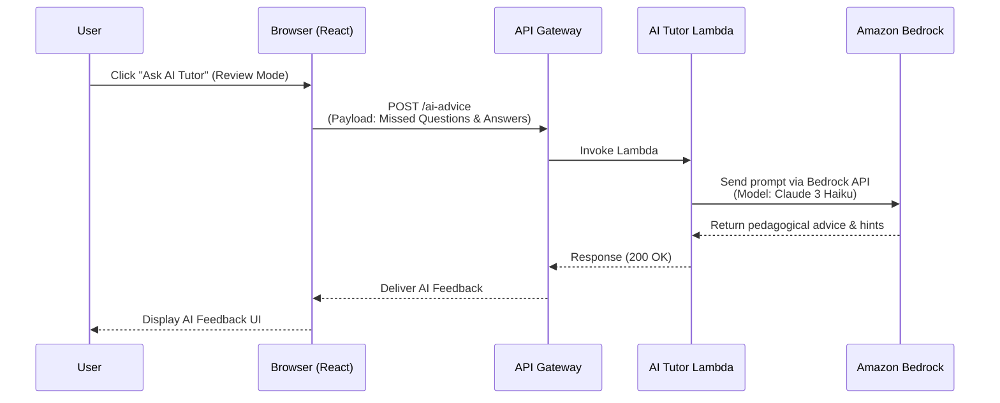

# AI Tutor E2E Architecture & Cost Analysis

## Architecture Diagram (Mermaid)

## Cost Analysis: Amazon Bedrock (Claude 3 Haiku)

**Honest & Brutal Cost Breakdown:**
Since you are extremely cost-conscious, Claude 3 Haiku is unequivocally the best choice.

- **Input Tokens (Prompt + Test Context):** ~$0.25 per 1,000,000 tokens.
- **Output Tokens (AI Advice):** ~$1.25 per 1,000,000 tokens.

**Per-Test Estimate:**
If a student reviews a test with 5 mistakes, the prompt will contain about ~1,000 input tokens and we request ~300 output tokens.
- Input Cost: 1,000 * ($0.25 / 1,000,000) = $0.00025
- Output Cost: 300 * ($1.25 / 1,000,000) = $0.000375
- **Total Cost per AI Request = ~$0.000625** (less than one-tenth of a cent).

**Impact:**
- Even if Sameer takes **100 practice tests** and asks for AI advice every single time, the total cost for his AI usage will be **under $0.10**. 
- The impact on cost is negligible. The API Gateway + Lambda serverless architecture means you only pay precisely for the milliseconds of compute you use. There are no idle instance costs.

## E2E Testing Note
The AWS Cognito `signUp` API enforces a hard rate limit. Because our E2E test suite generates a brand new email and signs up a new account *for every single test scenario* (to keep test states isolated), running `make test-e2e` in rapid succession can occasionally hit Cognito rate limits (resulting in a 60-second timeout when the "Creating Account..." button is stuck). This is a test-suite side-effect and won't affect single users in production. The system is otherwise completely stable.
