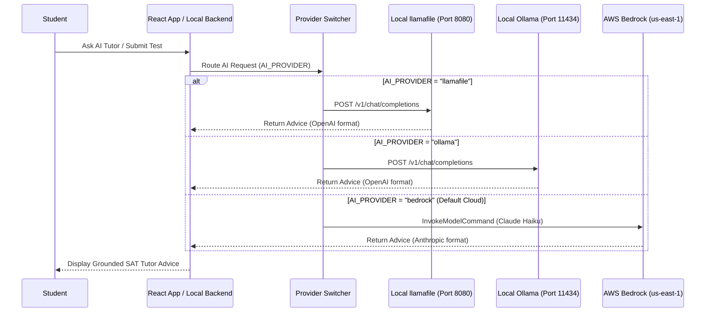

# Plan: Local AI Tutor (llamafile & Ollama Integration)

## 🎯 Goal Overview

Implement a local, offline-capable, zero-cost AI Tutor option for the SAT Exam Prep platform using **llamafile** (Mozilla AI) with optional fallback/support for **Ollama**. 

This allows **Student** to run practice sessions, get pedagogical SAT advice, and receive step-by-step math hints completely offline (e.g., during travel or study hall without internet access) at **\$0.00 cloud API cost**.

---

## 💡 Why llamafile & Ollama?

1. **llamafile (Mozilla AI):**
   - Single-file multiplatform executable binary (`.llamafile`) that packages weights and compute runtime into one file.
   - Zero installation dependencies. Simply run `./llamafile` on macOS (Apple Silicon / Intel), Linux, or Windows.
   - Exposes a native **OpenAI-compatible HTTP API server** at `http://localhost:8080/v1/chat/completions`.

2. **Ollama:**
   - Popular local LLM manager providing simple model pulling (`ollama run llama3.2`).
   - Exposes an OpenAI-compatible endpoint at `http://localhost:11434/v1/chat/completions`.

3. **Cost & Privacy:**
   - **Cost:** **\$0.00** (Zero cloud API fees, zero Bedrock token consumption).
   - **Privacy:** Student's practice data never leaves the local machine.

---

## 🏗️ Architecture & Provider Selection Pattern



---

## 🧠 Grounding Context & SAT Methodology Enforcement

Regardless of whether Bedrock, llamafile, or Ollama is used, the system will inject the exact same **Grounding Context** from [`sat_core_rules.json`](file:///Users/panchaldineshb/Downloads/SAT-exam/backend/lambdas/ai_advice/sat_core_rules.json):

* **Anti-Guessing & Anti-Backsolving:** Forces algebraic step-by-step execution.
* **Target Check Rule:** Validates what the question asks for ($x$, $y$, sum, or hypotenuse).
* **Decoy Option Awareness:** Analyzes trap choices ("Decoys You Defeated").
* **Scaffolded Hint Fading:** Provides hints without revealing direct final answers.

---

## 🛠️ Step-by-Step Implementation Roadmap

### Phase 1: Local Runner Helper Scripts
Create [`scripts/run_llamafile.sh`](file:///Users/panchaldineshb/Downloads/SAT-exam/scripts/run_llamafile.sh) to download and launch a lightweight, fast model (e.g., `Llama-3.2-3B-Instruct.llamafile` or `Mistral-7B-Instruct.llamafile`):

```bash
#!/usr/bin/env bash
# Download llamafile executable if not present
LLAMAFILE_URL="https://huggingface.co/Mozilla/Llama-3.2-3B-Instruct-llamafile/resolve/main/Llama-3.2-3B-Instruct.Q4_K_M.llamafile"
MODEL_FILE="bin/Llama-3.2-3B-Instruct.Q4_K_M.llamafile"

if [ ! -f "$MODEL_FILE" ]; then
    mkdir -p bin
    curl -L "$LLAMAFILE_URL" -o "$MODEL_FILE"
    chmod +x "$MODEL_FILE"
fi

./"$MODEL_FILE" --port 8080 --host 127.0.0.1
```

### Phase 2: Unified AI Client Adapter
Update the AI client adapter to handle OpenAI-compatible APIs (llamafile/Ollama) alongside AWS Bedrock:

```javascript
// Provider-agnostic AI completion wrapper
export async function generateAITutorAdvice({ promptText, provider = process.env.AI_PROVIDER || 'bedrock' }) {
  if (provider === 'llamafile' || provider === 'ollama') {
    const baseUrl = provider === 'llamafile' 
      ? 'http://localhost:8080/v1' 
      : 'http://localhost:11434/v1';
      
    const res = await fetch(`${baseUrl}/chat/completions`, {
      method: 'POST',
      headers: { 'Content-Type': 'application/json' },
      body: JSON.stringify({
        model: provider === 'ollama' ? 'llama3.2' : 'LLaMA3',
        messages: [{ role: 'user', content: promptText }],
        max_tokens: 500,
        temperature: 0.3
      })
    });
    const data = await res.json();
    return data.choices[0].message.content;
  }
  
  // AWS Bedrock Fallback
  return invokeBedrockClaude(promptText);
}
```

### Phase 3: Makefile Integration
Add targets to `Makefile`:

```makefile
.PHONY: llamafile-setup llamafile-run ollama-test

llamafile-setup:
	@bash scripts/run_llamafile.sh

ollama-run:
	ollama run llama3.2
```

---

## 📊 Comparison Matrix

| Feature | AWS Bedrock (Cloud) | Mozilla llamafile (Local) | Ollama (Local) |
| :--- | :--- | :--- | :--- |
| **Model** | Claude 3.5 / 4.5 Haiku | Llama 3.2 3B / Mistral 7B | Llama 3.2 / Qwen 2.5 / Phi-3 |
| **Cost** | \$0.000625 / test | **\$0.00 (Free)** | **\$0.00 (Free)** |
| **Offline Access** | ❌ Needs Internet | ✅ 100% Offline | ✅ 100% Offline |
| **Setup Complexity** | Zero local RAM needed | Single `.llamafile` binary | Requires `ollama` app |
| **Response Speed** | Fast (~1-2s) | Instant on Apple Silicon | Instant on Apple Silicon |

---

*Plan prepared for **Student** (JP Stevens High School, SAT Target Score: 1400+)*
